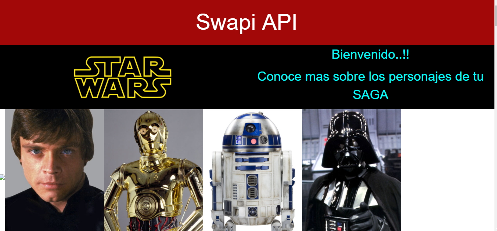
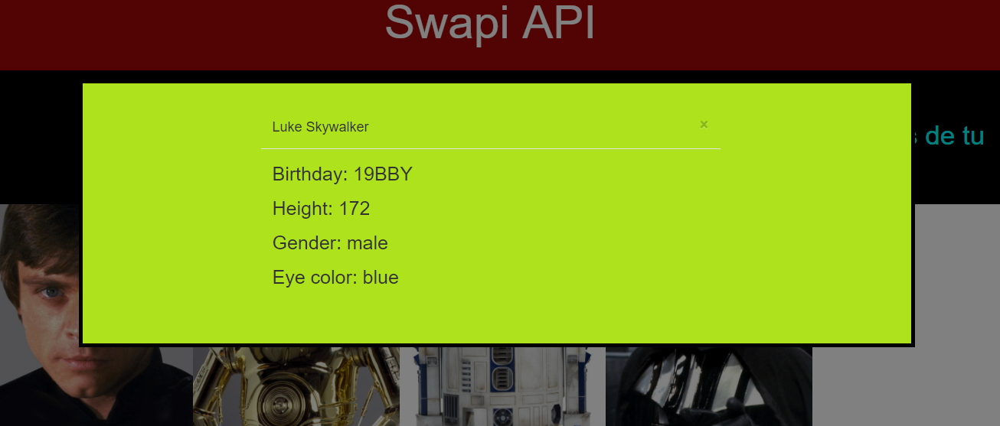
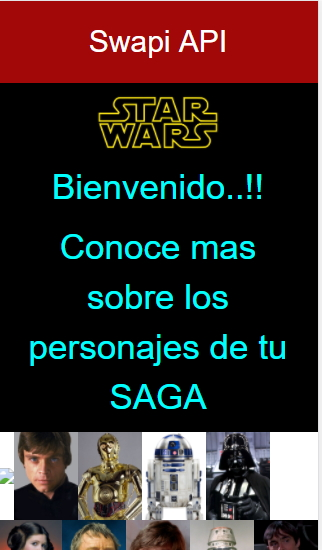
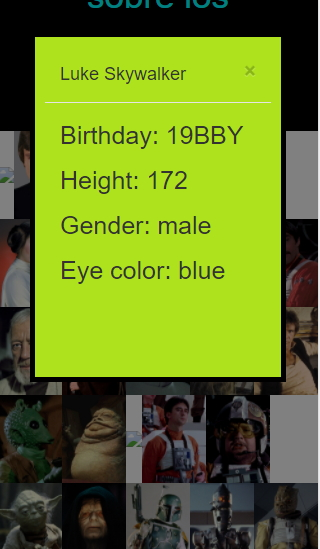

# SWAPI

> Recuerda seguir siempre esta [guía de estilos](https://github.com/Laboratoria/js-style-guide/)

1. **OBJETIVO DEL PROYECTO**

+ Realizar una página donde se muestre las imágenes de los personajes de la famosa saga de Star Wars utilizando la API Swapi para obtener las imagenes y también generar un modal y mostrar sus datos.

2. **FUNCIONALIDAD**

Desktop

_____________________________________________________________________________________________________________________

_____________________________________________________________________________________________________________________

Movie

_____________________________________________________________________________________________________________________

_____________________________________________________________________________________________________________________

3. **HERRAMIENTAS UTILIZADAS**
    3.1 HTML5
    _________________________________

    3.2 CSS3
    _________________________________

    3.3 BOOTSTRAP3
    _________________________________

    3.4 SWAPI API
    _________________________________

    3.5 starwars-visualguide API
    _________________________________

    3.6 node js

4. **COLABORADORAS**

    1. **NEFELI JOÑORUCO MORALES**
    2. **PATRICIA URCO OCHOA**

